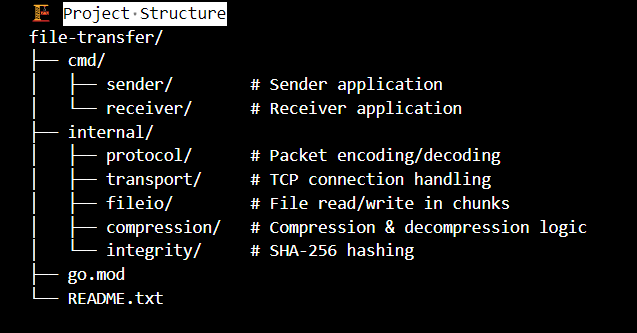
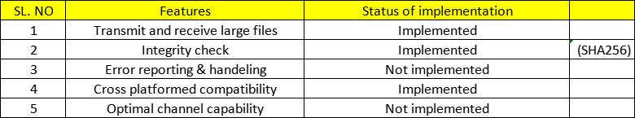
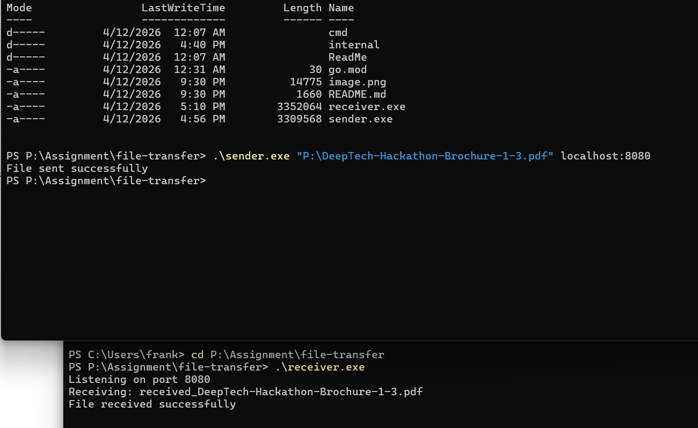

# Assignment: File Transfer Utility (TCP-based)

## 📌 Overview

This project implements a cross-platform file transfer utility using TCP sockets in Go.
It supports reliable and efficient transfer of large files (up to 16GB) between two networked systems.
The system is designed with a modular architecture, ensuring scalability, maintainability, and performance.

---------------------------------------

## 🚀 Features

✅ Transfer large files (up to 16 GB)  
✅ Chunk-based streaming (memory efficient)  
✅ Optional compression (gzip, based on file type)  
✅ Integrity verification using SHA-256  
✅ Error handling and reporting  
✅ Cross-platform compatibility (Windows/Linux/macOS)  
✅ Modular architecture (protocol, transport, fileio, compression, integrity)  
---------------------------------------

## Project Structure

---------------------------------------

## ▶️ How to Build
go mod tidy  
go build ./cmd/sender  
go build ./cmd/receiver  

---------------------------------------

## 🔄 Transfer Flow

Sender:  
Compute SHA-256 hash  
Decide compression  
Send metadata (filename + compression + hash)  
Send file in chunks  
Send END signal  
Wait for ACK  

Receiver:  
Receive metadata  
Parse compression + hash  
Receive chunks  
Decompress (if required)  
Write file  
Compute SHA-256  
Compare with sender hash  
Send ACK  

---------------------------------------

## Implementation overview

---------------------------------------

## Test logs

---------------------------------------

## 🔮 Further Improvements
1. Implement retransmission of only lost or corrupted chunks instead of resending the entire file.
2. Add a pre-transfer check to ensure the receiver has sufficient memory/storage capacity.
3. Introduce duplicate file detection at the receiver side to prevent redundant transfers.

---

## 📝 Notes
1. The project is implemented in Go (Golang) due to its cross-platform compatibility and efficient handling of concurrent operations.
2. LLMs were used as a supportive tool during development, as I am currently a beginner in Go.

#Thank you for reading
